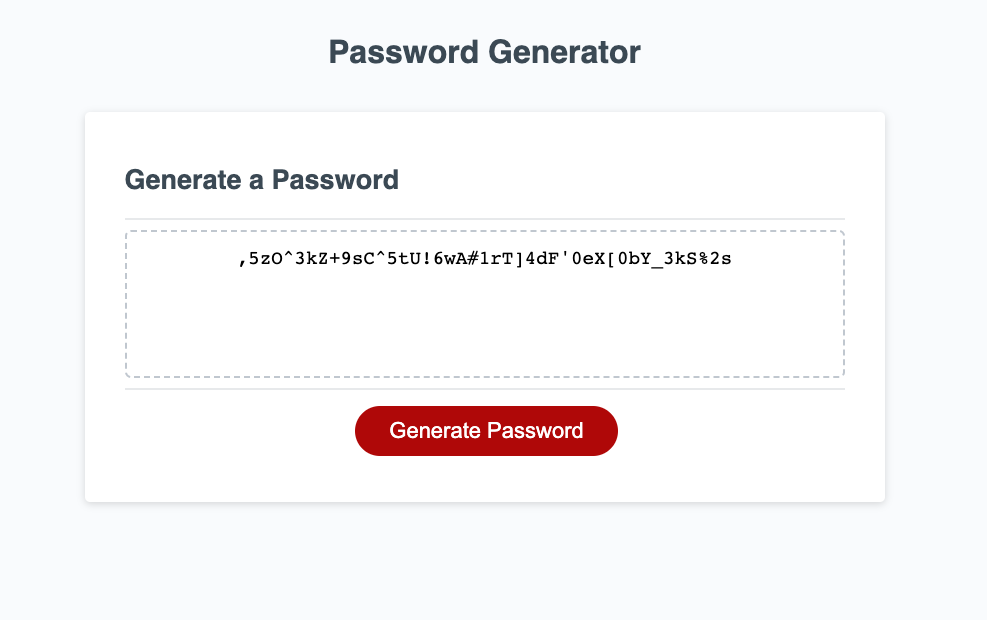

# Password-Generator
Password generator based on user input

## Description

This code generates a random password based on certain user inputs. 
* The user is prompted for the desired password length, and whether or not the password should contain special characters, numbers, lowercase letters, and uppercase letters. The code then generates a random password that meets the user's specified requirements.

* The code starts by defining four arrays of characters that can potentially be included in the password: special characters, numeric characters, lowercase characters, and uppercase characters. 
* The code then defines a function "getPasswordOptions()" which prompts the user for the password length and the types of characters they want included in the password. If the user's input is invalid (e.g. if they enter a non-number for the password length), the function returns and alerts the user of the error.

* The function also checks that at least one type of character is selected, otherwise it returns and alerts the user that they must select at least one option.

* The function create an object "userInput" with the user's input. The function then returns this object.

* The code then defines a function "getRandom(arr)" which returns a random element from the given array.

* The code then defines a function "generatePassword()" which calls the "getPasswordOptions()" function and uses the returned object to determine which types of characters to include in the password.

* The code uses the "getRandom(arr)" function to select a random character from the appropriate arrays of characters to include in the password. The password is generated by concatenating together the selected random characters, with the final password being the desired length specified by the user.

## Installation

N/A

## Usage

Click on the **generate password** and answer a few questions. The password geneator then generates a password that meets your criteria. 

Deployed application: https://ginacamelia.github.io/Password-Generator/

## Credits

N/A

## License

Check the LICENSE file for details in the repository